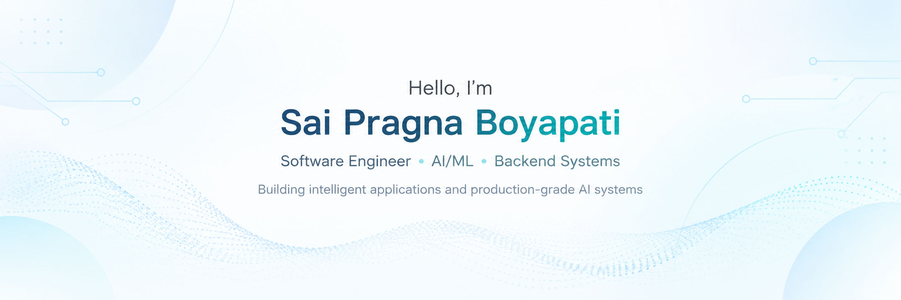

<!-- 

  

 -->

<!-- <h3 align="center">
<b>Building intelligent applications and production-grade software systems, with a focus on AI engineering, backend development, retrieval systems, and scalable infrastructure.</b>
</h3> -->

 

### 👋 About Me

- 👨‍💻 Recently completed my Masters in CS at the [University of Southern California](https://www.usc.edu/)
- 🤖 Interested in **Agentic AI, RAG, LLM orchestration, semantic retrieval & intelligent backend systems**
- 🌱 Currently deepening my knowledge of **distributed systems, cloud infrastructure & production AI**
- 🔭 Actively seeking **Full-time and Internship** AI/ Software Engineer oppurtunities in the United States

 

### 🛠️ Technology Stack

**Languages**  &nbsp; &nbsp; &nbsp; &nbsp; &nbsp; &nbsp; &nbsp; &nbsp; &nbsp; &nbsp;       

**AI / ML**  &nbsp; &nbsp; &nbsp; &nbsp; &nbsp; &nbsp; &nbsp; &nbsp; &nbsp; &nbsp; &nbsp; &nbsp; &nbsp;              

**Backend & Frameworks**  &nbsp; &nbsp;       

**Databases & Data**  &nbsp; &nbsp; &nbsp; &nbsp; &nbsp; &nbsp;      

**Systems & APIs**  &nbsp; &nbsp; &nbsp; &nbsp; &nbsp; &nbsp; &nbsp; &nbsp;     

**Cloud & DevOps** &nbsp; &nbsp; &nbsp; &nbsp; &nbsp; &nbsp; &nbsp;       

**Tools & Platforms** &nbsp; &nbsp; &nbsp; &nbsp; &nbsp; &nbsp;       

 

<h4 align="left" style="display: inline;">🤝 Let's Connect - </h4> 

 &nbsp;&nbsp;

 

#### 🚀 Projects detailed below ↓

<!--
**pragna9h/pragna9h** is a ✨ _special_ ✨ repository because its `README.md` (this file) appears on your GitHub profile.

Here are some ideas to get you started:

- 🔭 I’m currently working on ...
- 🌱 I’m currently learning ...
- 👯 I’m looking to collaborate on ...
- 🤔 I’m looking for help with ...
- 💬 Ask me about ...
- 📫 How to reach me: ...
- 😄 Pronouns: ...
- ⚡ Fun fact: ...
-->
